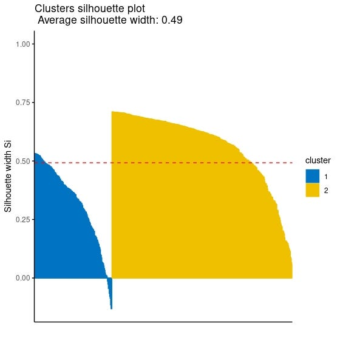

In the previous posts of this series, I covered [methods to determine the optimal number of clusters](https://medium.com/@ozturkfemre/unsupervised-learning-determination-of-cluster-number-be8842cdb11), how [k-means](https://medium.com/@ozturkfemre/unsupervised-learning-in-r-k-means-clustering-86df8b29ed27) , [k-medoids](https://medium.com/@ozturkfemre/unsupervised-learning-in-r-k-medoids-clustering-8645a6521e4), [hierarchical](https://medium.com/@ozturkfemre/unsupervised-learning-in-r-hierarchical-clustering-6e27260a11ff), and [density based](https://medium.com/@ozturkfemre/unsupervised-learning-in-r-density-based-clustering-774341a13519) clustering algorithms work in detail. In this sixth post of the Unsupervised Learning in R series, I will try to explain cluster validation metrics.

Cluster validation is a measure used to assess the quality of clustering results. Cluster validation is usually divided into two categories: internal cluster validation and external cluster validation.

Internal Cluster validation measures how homogeneous a cluster is within itself and the success of the clustering method. Internal cluster validation measures are related to the clustering algorithm itself and can vary with the number of clusters, cluster size, number of observations and data size. Some of the internal cluster validation measures are as Silhouette Coefficient, Connectivity and Dunn Index.

External cluster validation is measured by comparing clustering results with external data. For example, in a classification problem, clustering results can be compared with actual classes. External cluster validation measures are used to measure the accuracy of clustering results. Examples are the Corrected Rand Index and Meila's Variation of Information (MIV).

In many platforms, such as Kaggle and github, I see that this step is either not done at all, or is skipped with a few metrics reviews. However, I think this step is very important. Cluster validity metrics are used to evaluate clustering results and make comparisons between different clustering methods. It is important to choose an appropriate metric to achieve an accurate clustering result and to ensure the reliability of the results. It is also important to understand clustering metrics in order to correctly interpret and analyze clustering results.

In this post, I will try to explain some cluster validation metrics such as Connectivity, Adjusted Rand Index and Meila's Variation of Information metrics. Since I explained Silhouette and Dunn Index in the post "[methods to determine the optimal number of clusters](https://medium.com/@ozturkfemre/unsupervised-learning-determination-of-cluster-number-be8842cdb11)", I will only show their code for validation. Just as always, I will use the same dataset, [Breast Cancer Wisconsin](https://archive.ics.uci.edu/ml/datasets/breast+cancer+wisconsin+%28diagnostic%29) from the UCI Machine Learning Repository in the analysis. For all metrics, I will use k-means clustering for 2 clusters.

------------------------------------------------------------------------

#### Connectivity

Connectivity is a measure of the similarity of an observation unit to other observation units in its cluster. Connectivity underlies a hierarchical clustering method and plays an important role in the evaluation of clustering results.

The connectivity of a cluster is calculated by averaging the distances between each observation unit in the cluster and all other observation units within the cluster. This measure of connectivity is used to determine how homogeneous the cluster is as a whole and the success of the clustering method. Lower connectivity indicates that a cluster is homogeneous and gives a good clustering result.

There are different ways to calculate connectivity, but a common approach is:

1.  Compute the pairwise distances between all observations in the dataset.

2.  For each observation in a cluster, find the closest observation outside the cluster, and calculate the distance between them.

3.  For each observation in a cluster, find the closest observation within the cluster, and calculate the distance between them.

4.  Compare the two distances and assign the observation to the cluster it is closer to.

5.  Repeat the process for all observations in the dataset.

6.  Calculate the connectivity for each cluster as the ratio of the number of observations that are closer to other observations within the cluster than to any other observation outside the cluster, to the total number of observations in the cluster.

#### Connectivity in R

You can easily do this with the function `connectivity` in the `clValid` package. In the code below, you can find the code information required for first k-means clustering and then connectivity calculation.

```         
k2m_data <- eclust(pcadata, "kmeans", k = 2, nstart = 25, graph = F)  connectivity(k2m_data$cluster, # clustering vector              Data = df, # original data set               method = "euclidean" # distance metric )
```

```         
[1] 64.96498
```

------------------------------------------------------------------------

### Corrected Rand Index

The corrected Rand index (CRI) is a measure used to assess the similarity between two different clustering solutions for a given dataset. It is a modified version of the Rand index, which measures the proportion of correctly classified observations in both clustering solutions. The corrected Rand index takes into account the chance agreement between the two clustering solutions, and ranges from -1 to 1. Since I do not compare two different clustering solution in this example and we have label information in the dataset, I will use the label information to calculate CRI.

The corrected Rand index is calculated as follows:

1.  Compute the pairwise similarity between all observations in the dataset.

2.  Compare the two clustering solutions and count the number of pairs of observations that are in the same cluster in both solutions (a), in different clusters in both solutions (b), in the same cluster in one solution and different clusters in the other solution ( c ), and in different clusters in one solution and the same cluster in the other solution (d).

3.  Calculate the corrected Rand index as: \
    (a + b) / (a + b + c + d) --- ((a + c) \* (a + d) + (b + c) \* (b + d)) / ( (a + b + c + d) \* (a + b + c + d --- 1) )

4.  A higher corrected Rand index value indicates that the two clustering solutions are more similar, and thus the clustering solution is considered to be of higher quality. The corrected Rand index is sensitive to the number of clusters and the number of observations in the dataset.

#### Corrected Rand Index in R

You can easily do this with the function `cluster.stats` in the `fpc` package. In the code below, you can find the code for corrected rand index calculation.

```         
cluster.stats(d = dist(df), # distance matrix of the data               df$Diagnosis, # label information or the first clustering vector               k2m_data$cluster # our clustering vector or the second clustering vector               )$corrected.rand # to get corrected rand index
```

```         
[1] 0.4985402
```

------------------------------------------------------------------------

### Meila\'s Variation of Information

Meila\'s variation of information (MVI) is a measure used to assess the similarity between two different clustering solutions for a given dataset. It is based on the idea that the similarity between two clustering solutions can be measured by the amount of information that is gained or lost when going from one clustering solution to the other. MVI compares the entropy of each clustering solution, and ranges from 0 to log(n) where n is the number of observations. A lower MVI value indicates that the two clustering solutions are more similar. Again, since I do not compare two different clustering solution in this example and we have label information in the dataset, I will use the label information to calculate MVI.

The steps to calculate MVI are:

1.  Compute the contingency matrix that counts the number of observations in the same cluster for both clustering solutions.

2.  Compute the entropy for each clustering solution using the formula:\
    sum(p_i \* log(p_i)) \
    where \
    p_i is the proportion of observations in the i-th cluster.

3.  Compute Meila\'s VI as: \
    VI = H1 + H2--2\*I \
    where \
    H1, H2 are the entropies of the two clustering solutions, and I is the mutual information between the two clustering solutions.

#### Meila\'s Variation of Information in R

Just as CRI, you can easily do this with the function `cluster.stats` in the `fpc` package. In the code below, you can find the code for MVI calculation.

```         
cluster.stats(d = dist(df), # distance matrix of the data               df$Diagnosis, # label information or the first clustering vector               k2m_data$cluster # our clustering vector or the second clustering vector               )$vi # to get mvi coefficient
```

```         
[1] 0.5687046
```

### Silhouette Coefficient for Cluster Validation

Although there are many functions and packages to calculate the silhouette value for each observation, it is possible to plot the silhouette values for each observation using the fviz_silhouette function in the factoextra package. I will share with you the use of the fviz_silhouette function as I think it is a more practical solution to look at the plot instead of examining the vector containing the silhouette value of each observation.

> You can refer to [this post](https://fatihemreozturk.netlify.app/blogs/optimalk/) of this series for a detailed explanation, but as a reminder, the Silhouette coefficient takes values between -1 and 1 and the higher it is, the better the clustering.

```         
fviz_silhouette(k2m_data, # list containing clustering information                 palette = "jco", # for the colors of clusters                 ggtheme = theme_classic())
```



Since observations with negative silhouette value which can be seen in the cluster 1 which is colored blue in the plot indicates that they might be clustered wrongly, you might want to reach the index numbers of those observation. The following code might help you to get their index numbers:

```         
sil <- k2m_data$silinfo$widths[, 1:3] neg_sil_index <- which(sil[, 'sil_width']<0) sil[neg_sil_index, , drop = FALSE]
```

``` YAML
    cluster neighbor   sil_width 505       1        2 -0.01334316 224       1        2 -0.02627560 198       1        2 -0.04503110 442       1        2 -0.04567814 197       1        2 -0.06567648 331       1        2 -0.07905193 90        1        2 -0.08708848 215       1        2 -0.11522042 12        1        2 -0.13105913 376       1        2 -0.13159631
```

------------------------------------------------------------------------

### Dunn Index for Cluster Validation

Just as CRI and MVI, you can easily do this with the function `cluster.stats` in the `fpc` package. In the code below, you can find the code for Dunn Index calculation.

> You can refer to [this post](https://fatihemreozturk.netlify.app/blogs/optimalk/) of this series for a detailed explanation, but as a reminder, the higher Dunn Index means the better the clustering.

```         
cluster.stats(dist(df), k2m_data$cluster)$dunn
```

```         
[1] 0.005768501
```
